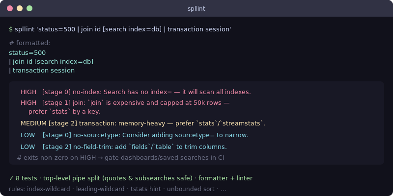

# spllint — Splunk SPL linter & formatter

[](https://github.com/JCreatesGH/spl-lint/actions)
[](https://www.python.org/)
[](LICENSE)

Catch slow and broken Splunk searches before they hit production. `spllint` parses an SPL pipeline, flags correctness and **performance** problems, and pretty-prints the search. Zero dependencies — drops into CI for your saved searches and dashboards.



## Install

```bash
pip install spllint
```

## Use it

```bash
spllint 'status=500 | join id [search index=db] | transaction session'
```

Exits non-zero on any HIGH finding, so it can gate a pipeline:

```yaml
- run: pip install spllint && spllint "$(cat search.spl)"
```

Add `--json` for machine-readable findings, or `--no-format` to skip the pretty-print. Color is
emitted only to a TTY, so CI logs stay clean.

## What it catches

| Severity | Rule | Why |
|----------|------|-----|
| HIGH | `no-index` / `index-wildcard` | Searches with no `index=` (or `index=*`) scan everything |
| HIGH | `join` | `join` is capped at 50k rows and slow — use `stats by key` |
| MEDIUM | `append` | `append`/`appendcols` run capped subsearches — prefer `stats`/`lookup` |
| MEDIUM | `leading-wildcard` | `=*term` can't use the index |
| MEDIUM | `transaction` | Memory-heavy — prefer `stats`/`streamstats` |
| MEDIUM | `subsearch` | `[ … ]` is capped at 10k results / 60s and may silently truncate |
| LOW | `stats-first` | Suggests `tstats` over accelerated data models |
| LOW | `sort-unbounded` | `sort` with no leading count (or `sort 0`) sorts the whole set |
| LOW | `mvexpand` | `mvexpand` multiplies the event count |
| LOW | `dedup` | `dedup` buffers all events — `stats latest(…) by key` is usually faster |
| LOW | `wildcard-field` | `field=*` is a no-op filter (matches every event with that field) |
| LOW | `no-sourcetype`, `no-field-trim` | Common hygiene |

The parser splits on **top-level pipes only**, so pipes inside quotes (`msg="a | b"`) and subsearches (`[ search … | … ]`) don't confuse it.

## Library

```python
from spllint import lint, format_spl, split_pipeline
for f in lint(search): print(f.severity, f.rule, f.message)
```

## Development

```bash
pip install -e .[dev] && python -m pytest -q   # 19 tests
```

## License

MIT
